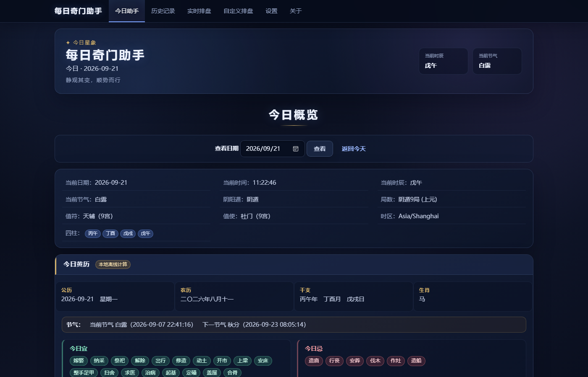
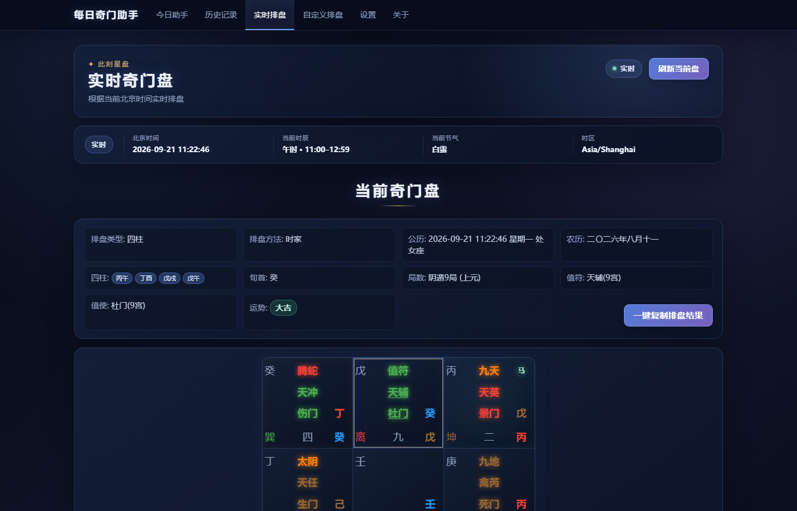
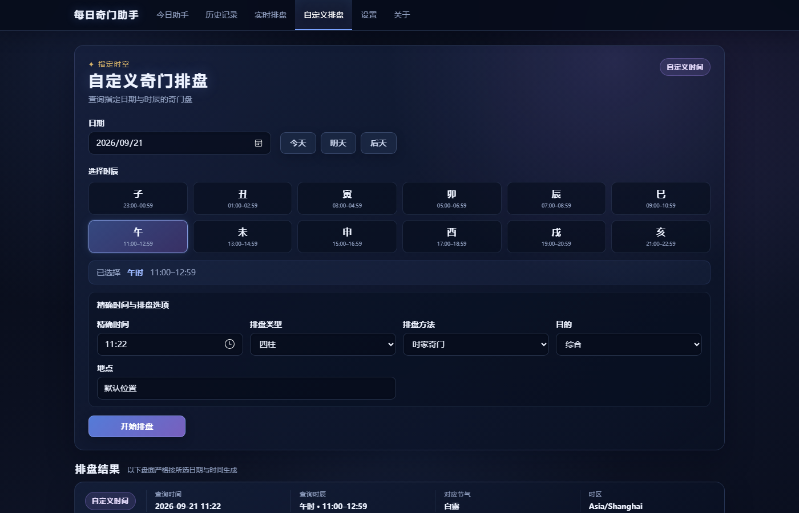
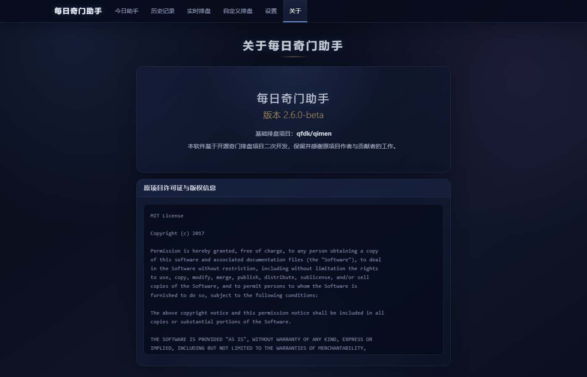

# 每日奇门助手

**本地优先的奇门遁甲 + 黄历 + AI 可选桌面助手**

当前项目：[`LeslieAn726/qimen-assistant`](https://github.com/LeslieAn726/qimen-assistant)

在保留 `qfdk/qimen` 奇门遁甲排盘能力的基础上，加入离线黄历、每日记录、可选 AI 建议、数据备份与 Electron 桌面体验。

> 传统术数内容仅作文化研究与娱乐参考，不构成医疗、法律、投资或其他专业建议。

## Features / 功能

- 今日奇门、实时排盘与自定义时间排盘，展示阴阳遁、局数、值符、值使与九宫信息
- 基于 `lunar-javascript` 的完全离线老黄历
- 今日计划、重要事项、完成情况与复盘的本地记录
- 历史记录浏览与按日期回看
- OpenAI-compatible 可选 AI 今日建议；AI 不参与排盘计算
- 深色星空 UI，兼顾桌面窗口和 Web 页面
- Windows Electron 桌面窗口、单实例运行与本地 JSON 数据持久化
- 设置、历史记录、备份与恢复

## Screenshots / 截图

### 今日助手



### 实时奇门盘



### 自定义奇门排盘



### 深色星空 UI



截图使用全新隔离测试数据生成，不包含 API Key、私人计划、用户路径或第三方角色内容。截图提交规范见 [docs/screenshots/README.md](docs/screenshots/README.md)。

## 技术栈

- Node.js 22.12+
- Express 4、EJS、原生 HTML/CSS/JavaScript
- Electron 44、electron-builder
- `lunar-javascript` 1.7.x
- Node.js 内置测试运行器

## 本地开发

```bash
npm ci
npm test
npm start
```

Web 版默认访问 `http://localhost:3000/today`。桌面开发模式使用：

```bash
npm run desktop
```

构建 Windows NSIS 安装包：

```bash
npm run build:win
```

构建结果输出到 `dist/`。Windows 构建使用 `assets/icon.ico`，其中包含 256、128、64、32、16 像素图层。

## Privacy / 数据与隐私

- Web 模式将数据保存在项目 `data/` 目录。
- 桌面模式将数据保存在 Electron `app.getPath('userData')` 下，不依赖安装目录；Windows 通常类似 `%APPDATA%\每日奇门助手`，实际位置由 Electron 决定。
- 每日记录与设置只存本机；程序没有云同步功能。
- AI 默认可关闭。启用后，只有当前盘面、规则分析、今日计划和重要事项会按当前实现发送到用户配置的 OpenAI-compatible 服务。
- API Key 单独保存在桌面用户数据目录的 `ai-settings.json`，不会返回 Renderer，也不会写入每日记录。
- 卸载程序默认不删除 Electron userData，便于重装后保留历史数据。

更多信息见 [PRIVACY.md](PRIVACY.md) 与 [SECURITY.md](SECURITY.md)。

## 数据备份

设置页可创建和恢复本地备份。备份位于 Electron userData 的 `backups/` 子目录。恢复前会先创建当前状态的安全备份；损坏文件会原样保留为灾难备份，再从已验证的备份恢复。

建议定期将备份目录复制到独立磁盘，并在重要升级前手动备份。

## AI 配置说明

AI 是可选的解释层，不修改、不补算奇门盘。需要自行提供兼容 OpenAI Chat Completions 接口的 Base URL、模型名和 API Key。

ChatGPT Plus/Pro 订阅不等于 OpenAI API 额度；API 服务的计费、数据处理和可用性由你选择的 Provider 决定。不要提交包含真实 API Key 的配置文件、日志或截图。

## 项目结构

```text
app.js                 Express 应用与路由装配
electron/              Electron 主进程与桌面应用生命周期
lib/                   原奇门排盘核心算法
services/              每日、黄历、AI 与本地建议服务
storage/               可配置路径的 JSON 存储层
views/                 EJS/HTML 页面
public/                本地 CSS、JavaScript 与静态前端资源
assets/                Windows 品牌图标
scripts/               品牌资源构建工具
test/                  自动化测试
docs/                  架构、算法口径与资产说明
```

详细架构见 [docs/ARCHITECTURE.md](docs/ARCHITECTURE.md)，公开发布前请执行 [Release 检查清单](docs/RELEASE_CHECKLIST.md)。

## 开源来源与许可证

本项目基于开源项目 [`qfdk/qimen`](https://github.com/qfdk/qimen) 二次开发，保留原项目许可证与版权信息。项目代码沿用仓库中的 [MIT License](LICENSE)。

第三方软件许可证见 [THIRD_PARTY_NOTICES.md](THIRD_PARTY_NOTICES.md)。V2.6 核心发行版不包含第三方角色图像或动画素材。

## 参与贡献

提交问题或代码前请阅读 [CONTRIBUTING.md](CONTRIBUTING.md)。安全问题请按 [SECURITY.md](SECURITY.md) 的非公开流程报告。

## 当前发布状态

`2.6.0-beta` 已精简为纯工具发行版，不包含第三方角色素材，并保留奇门、黄历、每日记录、可选 AI、深色星空 UI 和 Windows 桌面版。正式创建公开 Release 前，维护者仍应在带完整 `.git` 元数据的仓库中执行状态、忽略规则和历史大文件检查，并确认根 `LICENSE` 中原项目版权人信息。
